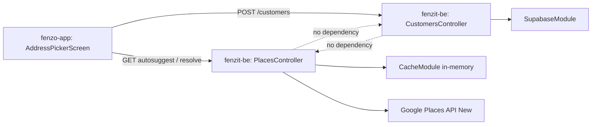

# Architecture Spine — Address Autosuggest for Add Customer

## Design Paradigm

Inherits fenzit-be's modular monolith (feature modules, no cross-imports, shared `SupabaseModule`/`CacheModule`). This feature adds one new backend feature module, `PlacesModule` (`src/places/`), sibling to `customers/`/`auth/`, service-only — no abstract repository layer, matching the codebase's accepted AR-2 drift. `PlacesModule` depends **only** on `CacheModule`, not `SupabaseModule` — it is a pure external-API proxy with no database access.

On fenzo-app, a new feature folder `src/features/addressPicker/` matches the existing `src/features/customers/` convention: one folder per domain feature, plain hooks + a resource file, no new state-management library introduced.

## Invariants & Rules

### AD-1 — PlacesModule is an independent, DB-less feature module
- **Binds:** `src/places/**` (fenzit-be)
- **Prevents:** Places code creeping into `CustomersModule` (cross-module coupling) or gaining unnecessary Supabase access
- **Rule:** `PlacesModule` has no dependency on `SupabaseModule` or any other feature module — its only dependency is the global `CacheModule` provider (already `isGlobal: true`; no explicit `imports: []` entry is needed or expected, same as `AuthModule` today). No feature module imports `PlacesModule`'s internals directly — the frontend is the only orchestrator that calls both `/places/*` and `/customers` as separate, unrelated requests.

### AD-2 — Google Places API surface: Autocomplete (New) + Place Details (New) only, normalized at the boundary
- **Binds:** `PlacesProvider` and its implementations
- **Prevents:** Reintroducing Text Search (New) (`places:searchText`) — confirmed wrong fit for type-ahead in the companion research; and `GooglePlacesProvider`/`MockPlacesProvider` disagreeing on what shape crosses their shared interface
- **Rule:** An abstract `PlacesProvider` class (mirrors the existing `OtpDeliveryProvider`/`OtpSessionStore` DI-swap convention) with two methods:
  - `autosuggest(input, sessionToken): Promise<Suggestion[]>`
  - `resolve(placeId, sessionToken): Promise<ResolvedPlace>`

  `ResolvedPlace` is the **normalized** shape from AD-4 — `GooglePlacesProvider` owns all mapping from Google's raw JSON (including null-normalization, AD-4) into it; no caller or `MockPlacesProvider` ever sees Google's response shape. Backed by Bun native `fetch`, `AbortSignal.timeout(4000)`, no new HTTP client dependency. `MockPlacesProvider` returns fixture `ResolvedPlace`/`Suggestion` objects directly, following the same pattern as `MockOtpDeliveryProvider`.

### AD-3 — Session token is FE-owned; BE is a stateless passthrough
- **Binds:** both `/places/*` endpoints, `AddressPickerScreen`
- **Prevents:** BE generating, storing, or reusing a session token across users/requests — which would break Google's session-billing model and could leak one user's session grouping into another's
- **Rule:** FE generates a UUID v4 when `AddressPickerScreen` opens; the same token rides every `autosuggest` call and the terminating `resolve` call; discarded on close or selection. `sessionToken` is a required (DTO-validated) field on both endpoints — BE never fabricates a default.

### AD-4 — API contract
- **Binds:** `PlacesController`, `ResolvedPlace` type, amended `CreateCustomerDto`/`CreateCustomerRequest`
- **Prevents:** Ad-hoc request/response shapes per caller; unauthenticated or role-open access to a cost-bearing proxy; FE and BE independently guessing the amended customer-creation payload; ambiguity over null vs. omitted vs. empty-string fields
- **Rule:**
  ```
  GET /places/autosuggest?q={string}&sessionToken={uuid}
    -> 200 { suggestions: [{ placeId: string, text: string }] }

  GET /places/resolve/:placeId?sessionToken={uuid}
    -> 200 ResolvedPlace {
         placeId: string,
         formattedAddress: string,
         city: string | null,        // never omitted, never ''
         pincode: string | null,     // never omitted, never ''
         latitude: number,
         longitude: number
       }
    -> 502 { statusCode: 502, error_code: 'PLACES_UPSTREAM_ERROR', message } if Google
       returns a placeId with no `location` — never a 200 with fabricated/null coordinates.
       Google does not document location as guaranteed-present for every placeId, so this
       is treated as a provider failure, not a valid low-confidence result.
  ```
  `city`/`pincode` are read from `addressComponents`/`postalAddress` per AD-5; a missing component normalizes to `null` in `GooglePlacesProvider`, never an empty string or a dropped key. (`area` is deliberately not part of `ResolvedPlace` — see AD-7.)

  Both routes sit behind the existing global `JwtAuthGuard` + `@Roles(Role.OWNER)` — matching `POST /customers`, since only owners add customers today.

  **`POST /customers` amendment:** `CreateCustomerDto` (BE) and `CreateCustomerRequest` (FE) both gain five new optional fields, all nullable/omittable, alongside the existing `name`/`countryCode`/`phoneNumber`/`address`/`city`:
  ```
  formattedAddress?: string
  pincode?: string
  latitude?: number
  longitude?: number
  placeId?: string
  ```
  A customer can still be created with none of these set (manual entry, no picker used) — see AD-7.

### AD-5 — Request parameters are server-fixed, never client-configurable
- **Binds:** `GooglePlacesProvider`
- **Prevents:** A client-supplied region/field-mask silently changing Google billing tier or search scope
- **Rule:** `includedRegionCodes: ['IN']` always. Place Details field mask is always exactly `id,formattedAddress,location,addressComponents,postalAddress` — `id` is its own free "Essentials IDs Only" SKU; `formattedAddress`/`location`/`addressComponents`/`postalAddress` are Essentials-SKU; **never** `displayName` (Pro-tier). Pin code is read from `postalAddress.postalCode`; `city` from the `addressComponents` entry typed `locality`. (`addressComponents` is kept in the mask specifically for `city` — dropping it would lose that field.)

### AD-6 — Cost control lives inside PlacesModule, not a shared utility (yet)
- **Binds:** `PlacesModule`
- **Prevents:** Unbounded Google spend from a runaway client or retry loop; premature abstraction across two unrelated domains; `autosuggest`'s much higher call volume (per keystroke) starving `resolve`'s budget (once per selection) by sharing one counter
- **Rule:** A self-contained cache-manager increment-counter (same pattern as `in-memory-otp-session.store.ts`), keyed **per endpoint**: `places:rate:{tenantId}:autosuggest` and `places:rate:{tenantId}:resolve` as two independent budgets — never one shared key. Exceeding either rejects with `429 { statusCode: 429, error_code: 'RATE_LIMITED', message }` (same `GlobalExceptionFilter` shape as every other error, per AR-14) before calling Google. A short-TTL result cache (reuse the global 300s `CacheModule` TTL) is keyed on normalized query text + region for `autosuggest`, and on `placeId` for `resolve`, deduping repeat lookups across users. This logic is **not** extracted into `common/` — duplicating the OTP counter's shape once is acceptable; extracting is deferred until a third consumer needs it.

  **FE-side debounce is a required coequal lever, not optional polish:** `useAddressAutosuggest` must debounce keystrokes (≈300ms) and enforce a minimum query length (≈3 chars) before calling `/places/autosuggest` at all — this is what keeps the BE rate limiter's budget realistic rather than a constant backstop. The BE limiter above is the hard guarantee either way; the FE debounce is what keeps it from being hit under normal use. Exact millisecond/character values are implementation-tunable (see Deferred); the presence of debounce + a minimum-length gate is not.

### AD-7 — Customer schema: additive, nullable, backward-compatible — `area` stays a concatenation, not a column
- **Binds:** `customers` table, `CreateCustomerDto`
- **Prevents:** Breaking manual (no-map) address entry; silently inventing a new `area` persistence path that contradicts the app's existing, deliberate convention
- **Rule:** **Correction from review:** `area` is not a dropped/latent gap — `CustomersScreen.tsx` and `NewJobScreen.tsx` already concatenate it into `address` as `"<address>, <area>"` before calling `POST /customers`, with an explicit code comment explaining why (`POST /customers` has no `area` field). This spine does **not** change that — it stays exactly as-is. Places auto-fill (per the confirmed product decision) populates the same existing City/Area text inputs; submission still runs through the existing concatenation, untouched.

  Migration adds only `formatted_address TEXT`, `pincode TEXT`, `latitude DOUBLE PRECISION`, `longitude DOUBLE PRECISION`, `place_id TEXT` — all nullable, applied via Supabase MCP per AR-11. `address` and `city` are unchanged and remain free-text, user-editable. A customer can still be created with only manual free-text `address`/`city` (area folded in as today) and none of the five new fields set — the Places flow is additive, never mandatory.

### AD-8 — Picker-to-caller data return: serializable `setParams`, matching the app's existing convention — no callbacks in route params, no global store
- **Binds:** `AddressPickerScreen`, `CustomersScreen`, `NewJobScreen`, `AddCustomerSheet`
- **Prevents:** Introducing a global store (Zustand/Context) for a single flow; a non-serializable function riding in route params, which contradicts this app's real precedent (`JobsScreen.tsx:161` uses `navigation.setParams({ scope: undefined })` to clear a consumed param — the only existing "hand a value back and clear it" pattern in the codebase, and it's serializable-only, no callbacks)
- **Rule:**
  1. `AddCustomerSheet` opens `AddressPickerScreen` via `navigation.navigate('AddressPicker')` (no params needed to open it).
  2. On selection, `AddressPickerScreen` calls `navigation.navigate('Customers' | 'NewJob', { pendingAddress: ResolvedPlace })` — back to whichever screen hosts the open `AddCustomerSheet` — then that screen is focused again (the native-stack pop happens as part of the same navigation call). `pendingAddress` is plain, fully serializable JSON (the `ResolvedPlace` shape from AD-4).
  3. The hosting screen (`CustomersScreen`/`NewJobScreen`) reads `route.params.pendingAddress` in a `useEffect`, passes it down as a new prop (e.g. `initialAddress`) into `AddCustomerSheet` to seed its (extended) local state, then immediately calls `navigation.setParams({ pendingAddress: undefined })` to clear it — mirroring the `JobsScreen` precedent exactly.
  4. `AddCustomerSheet`'s local state extends beyond today's `NewCustomerInput` (`name`/`phone`/`city`/`area`/`address`) to also hold `formattedAddress`/`pincode`/`latitude`/`longitude`/`placeId` — all optional, all still user-editable after the picker returns (the free-text `address` input is never made read-only).
  5. `src/store/index.ts` stays an unused stub — no global store introduced for this flow.

### AD-9 — Error boundaries
- **Binds:** `PlacesController`, `AddressPickerScreen`, `AddCustomerSheet`
- **Prevents:** A Places/Google outage blocking customer creation entirely
- **Rule:** Provider failure → `502 { error_code: 'PLACES_UPSTREAM_ERROR' }` (via existing `GlobalExceptionFilter` shape). No matches → `200` with an empty `suggestions` array, never an error. Own rate limit tripped → `429 RATE_LIMITED`, returned before any Google call. The free-text address/city/area inputs in `AddCustomerSheet` remain permanently editable regardless of picker outcome — manual entry is the standing fallback, not a degraded mode.

### AD-10 — Secrets
- **Binds:** `app.module.ts` Joi schema, `GooglePlacesProvider`
- **Prevents:** A client-side Maps key ever existing in the mobile bundle
- **Rule:** `GOOGLE_PLACES_API_KEY` added to the existing Joi env schema, consumed via `ConfigService.getOrThrow`. IP-restricted server key only — no client-side key, ever, per the research artifact's security finding.

### Dependency direction



## Inherited Invariants

| Inherited | From parent | Binds here |
| --- | --- | --- |
| Modular monolith, no cross-module imports | `docs/architecture.md` | `PlacesModule` and `CustomersModule` stay mutually independent (AD-1) |
| AR-13 global `JwtAuthGuard` + `RolesGuard` | `docs/architecture.md` | Both `/places/*` routes, `@Roles(Role.OWNER)` |
| AR-14 `GlobalExceptionFilter` single error shape | `docs/architecture.md` | AD-9 error responses |
| AR-17 Joi env validation via `ConfigService` | `docs/architecture.md` | AD-10 |
| AR-19 / AR-23 abstract-provider DI-swap convention | `docs/architecture.md` | AD-2 `PlacesProvider`/`GooglePlacesProvider`/`MockPlacesProvider` |
| AR-11 migrations via Supabase MCP only, SQL in `supabase/migrations/` | `project-context.md` | AD-7 migration |

## Consistency Conventions

| Concern | Convention |
| --- | --- |
| Naming | `places` module/routes (not `google` or `maps`) — the domain name, not the vendor's |
| Data & formats | Places endpoints return flat JSON (no envelope beyond NestJS default); errors always `{ statusCode, error_code, message }` per AR-14 |
| State & cross-cutting | Session token: FE-generated, BE-passthrough only (AD-3). Rate/result caching: in-memory `CacheModule`, no Redis (matches existing Phase 1 single-instance constraint already accepted for OTP) |
| Auth | `@Roles(Role.OWNER)` on both new routes, consistent with `POST /customers` |

## Stack

| Name | Version |
| --- | --- |
| Google Places API | (New) v1 — `places:autocomplete`, `places/{placeId}` |
| Bun | 1.3.13 (pinned per project-context.md) — native `fetch`, no new HTTP client dependency |
| NestJS | v11 (existing) |
| `@nestjs/cache-manager` | existing (in-memory, no Redis) |

## Structural Seed

```text
fenzit-be/src/places/
  places.module.ts
  places.controller.ts
  places-provider.ts          # abstract PlacesProvider
  google-places.provider.ts   # GooglePlacesProvider impl
  mock-places.provider.ts     # MockPlacesProvider (tests/dev)
  places-rate-limiter.ts      # self-contained cache-manager counter (AD-6)
  dto/
    autosuggest-query.dto.ts
    resolve-params.dto.ts

fenzo-app/src/features/addressPicker/
  AddressPickerScreen.tsx
  useAddressAutosuggest.ts    # debounce + session-token lifecycle
src/hooks/useDebounce.ts      # new generic hook (none exists today)
src/services/resources/places.ts
```

## Capability → Architecture Map

| Capability / Area | Lives in | Governed by |
| --- | --- | --- |
| Type-ahead address suggestions | `PlacesController.autosuggest`, `AddressPickerScreen` | AD-2, AD-4, AD-5, AD-6 (FE debounce) |
| Resolve selection → lat/long/pincode/city | `PlacesController.resolve` | AD-2, AD-4, AD-5 |
| Cost control | `PlacesModule` rate limiter + result cache + FE debounce | AD-6 |
| Customer address persistence (area unchanged) | `customers` table, `CreateCustomerDto` | AD-7 |
| Return picked address to Add Customer bottomsheet | `AddressPickerScreen` → `CustomersScreen`/`NewJobScreen` → `AddCustomerSheet` | AD-8 |

## Deferred

- Exact UX affordance for opening the picker (tap the whole field vs. a dedicated icon) — implementation/UX detail, not an invariant.
- Numeric rate-limit threshold (e.g. requests/min per tenant) — needs a real number at implementation time, informed by expected owner volume; the mechanism (AD-6) is fixed, the number isn't.
- Exact debounce ms / minimum-char count (≈300ms / ≈3 chars given as starting defaults) — tunable at implementation time; the requirement that both exist is fixed (AD-6), the numbers aren't.
- Multi-address-per-customer schema (home/office, etc.) — explicitly out of scope now per product decision; `customers.formatted_address`/`pincode`/`latitude`/`longitude`/`place_id` are single-address columns, not a child table. Revisit if that product decision changes.
- Extracting a shared rate-limiter/cache utility out of the OTP-store pattern into `common/` — deferred until a third consumer needs the same shape (AD-6).
- Refreshing stored place data via the retained `place_id` (e.g. periodic re-validation) — column is kept for future use, no refresh mechanism designed yet.
- CI/deployment wiring for the new `GOOGLE_PLACES_API_KEY` secret (AR-18, Dockerfile/CI, is itself already a known pre-launch gap in fenzit-be, unrelated to this feature).
- Runtime verification that `AddressPickerScreen` pushed on top of the stack, then navigating back with `pendingAddress`, behaves as expected in this app's actual `native-stack` configuration (screen options, `unmountOnBlur`, etc.) — the design (AD-8) follows React Navigation's documented default and the app's own `JobsScreen` precedent, but hasn't been runtime-verified against this specific navigator config.
