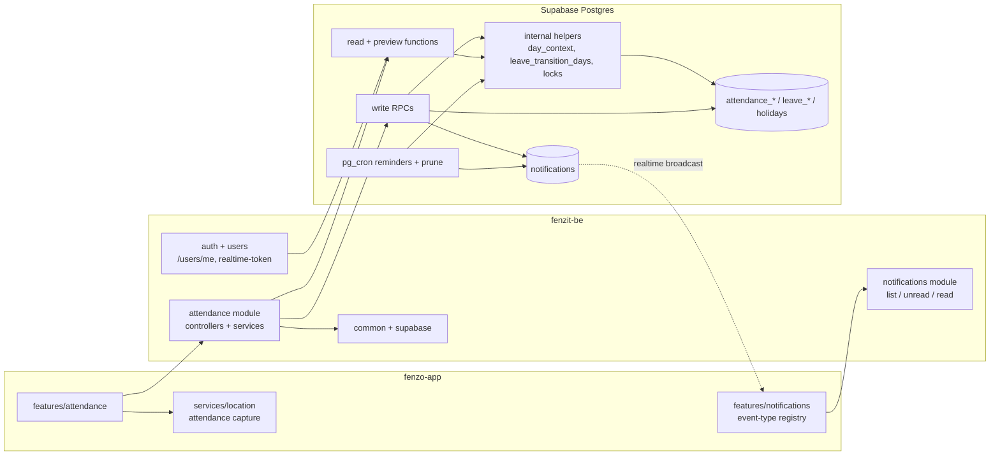
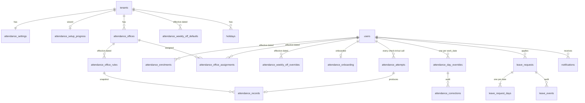
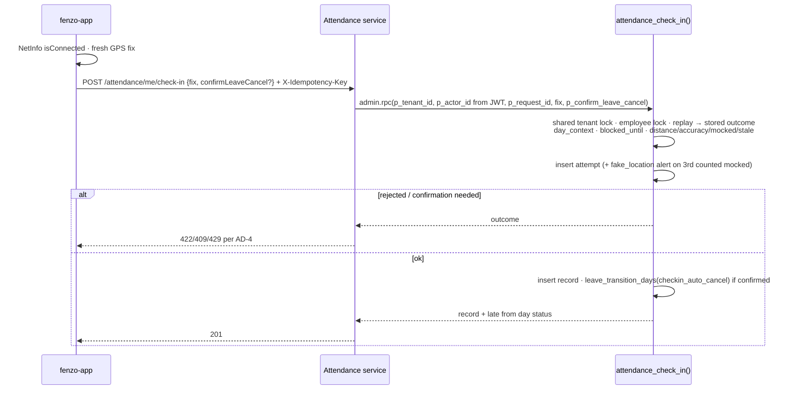

# Architecture Spine — Attendance & Leave

## Design Paradigm

Inherits fenzit-be's modular monolith: feature modules, services calling Supabase directly (AR-2 drift, ratified), the service-role client with explicit tenant filters, and RLS as a second layer. Attendance adds **one** backend feature module, `AttendanceModule` (`src/attendance/`), built as a **DB-centric domain core**:

- **Postgres owns the rules.** Distance, "today", Late/Early, day status, leave transitions, locks and notification side effects are SQL functions. Writes go through RPCs, reads through read functions, and both share internal helpers.
- **NestJS is the shell.** It verifies the JWT, validates DTOs, passes tenant/actor from the token into functions, maps outcomes to `ErrorCode`/HTTP, and maps snake_case to camelCase.
- **fenzo-app is a display client.** `src/features/attendance/` has its own navigation stack, renders what the server sends, and computes no attendance rule.



Allowed dependencies are the arrows. `attendance` never imports `jobs`, `workflow`, `sync`, `reports`, `users` or `notifications` in TypeScript, and none of them import `attendance`. `users` reaches attendance data only by calling the SQL function `attendance_access` (AD-17).

## Invariants & Rules

### AD-1 — Attendance is an isolated module in both repos [ADOPTED]

- **Binds:** NFR-12, all FRs; `src/attendance/**` (fenzit-be), `src/features/attendance/**` (fenzo-app)
- **Prevents:** attendance logic leaking into the job/workflow flow, or job code changing behaviour when attendance is off.
- **Rule:** All attendance code, tables, routes and event types are new and attendance-owned. Attendance must not change `advance_workflow_step`, `workflow.service.ts`, `activity_logs`, the `jobs.service` response mapping, `sync.service`, the report engine, the job IST "today" logic, `LocationCaptureScreen` or the job advance flow. Shared code may only be generalised without changing its behaviour. The only generalisations allowed are:
  - nullable notification `jobId` and the additive `entityType`/`entityId` fields;
  - a role-aware notifications screen;
  - a generic `Skeleton`;
  - a wizard shell;
  - `services/location`, generalised from `features/technicianApp/geolocation.ts` with the job helper kept unchanged;
  - `/users/me` fields;
  - additive `CursorScope` / `ErrorCode` / `AppMetrics` entries.

### AD-2 — The database is the single authority for attendance rules [ADOPTED]

- **Binds:** NFR-2, NFR-5, FR-7–FR-15, FR-23–FR-26
- **Prevents:** the app, NestJS and SQL each computing their own "today", distance, Late flag, working-day count or day status and disagreeing.
- **Rule:** These are computed only in SQL: distance (haversine), "today" and date boundaries, Expected start/end and Midpoint, Late/Early, the leave cut-off at Office Start time, working-day counts, revoke/cancel splits, day status, Days worked, leave request status and access state. Wherever the UX shows one of these before a write, it comes from a preview function (AD-24). NestJS validates only input shape and ranges. fenzo-app shows server values, except for the live "you are X m away" hint (`utils/distanceUtils.ts`), which is display-only and decides nothing.

### AD-3 — Every attendance function is service-role only; every multi-row write is one RPC [ADOPTED]

- **Binds:** NFR-1, NFR-3, NFR-6, all write FRs
- **Prevents:** state, audit and notification rows landing separately, and any attendance function (write **or read**) being callable with the app's public key.
- **Rule:**
  - Every function created by an attendance migration (write RPC, read or preview function, internal helper, trigger function, cron entry point) is `SECURITY DEFINER SET search_path = public` and has `REVOKE EXECUTE … FROM PUBLIC, anon, authenticated` in the same file (the grant pattern from migration `20260920000005`). All of them are called only through `createAdmin().rpc()`.
  - A write that touches more than one row-set, emits a notification, changes an effective-dated range or needs a lock is exactly **one** RPC. NestJS passes `p_tenant_id` and `p_actor_id` from the verified JWT, and the RPC re-checks that every client-sent id belongs to `p_tenant_id` (and, for a technician actor, to that technician).
  - Single-row, single-table writes with no side effect (wizard step marker, office name) may be plain guarded SQL through the admin client with an explicit `tenant_id` filter.
  - This is a **conscious exception** (user decision, 2026-09-25) to the 2026-09-20 "keep stored procedures to a minimum" rule.
  - `test/integration/rls-isolation.integration.spec.ts` scans `pg_proc` for names matching `^(attendance|leave)_` and asserts that `anon` and `authenticated` lack EXECUTE on every one.

### AD-4 — Check-in/out rejections are committed outcomes with a fixed error catalogue

- **Binds:** FR-7, FR-8, FR-9, NFR-9
- **Prevents:** a `RAISE` rolling back the rejected-attempt row and the fake-location alert, and the two repos inventing different error codes.
- **Rule:**
  - The check-in and check-out RPCs never `RAISE` for a validation rejection. They record the attempt (AD-15) and return an `outcome`.
  - The service maps outcomes 1:1:

    | Outcome | `ErrorCode` | HTTP |
    |---|---|---|
    | `too_far` | `ATTENDANCE_TOO_FAR` | 422 |
    | `low_accuracy` | `ATTENDANCE_LOW_ACCURACY` | 422 |
    | `mocked` | `ATTENDANCE_MOCK_LOCATION` | 422 |
    | `stale_fix` | `ATTENDANCE_STALE_FIX` | 422 |
    | `rate_limited` | `ATTENDANCE_RATE_LIMITED` | 429 + `Retry-After` |
    | `leave_confirmation_required` | `ATTENDANCE_LEAVE_CONFIRMATION_REQUIRED` | 409 |
    | `already_checked_in` | `ATTENDANCE_ALREADY_CHECKED_IN` | 409 |
    | `not_checked_in` | `ATTENDANCE_NOT_CHECKED_IN` | 409 |
    | `not_tracked` | `ATTENDANCE_NOT_TRACKED` | 403 |
    | `ok` | — | 201 |

  - 422 bodies carry `distanceM`/`radiusM`. `GlobalExceptionFilter` turns `retryAfterSeconds` into the `Retry-After` header, and fenzo-app reads that header.
  - fenzo-app's `apiError` must keep extra body fields (a generalisation under AD-1).
  - Other RPCs use the `PTxxx` SQLSTATE convention (PT409 state conflict, PT422 rule violation, with `HINT` carrying the `ErrorCode`).

### AD-5 — Serialisation through a two-level advisory lock

- **Binds:** NFR-3; all attendance/leave RPCs and the reminder job
- **Prevents:** check-in vs approve, revoke vs cancel, or holiday/rule changes vs per-employee writes resolving inconsistently, and deadlocks.
- **Rule:** Lock keys come only from `attendance_lock_tenant(tenant_id, exclusive bool)` and `attendance_lock_employee(employee_id)`, which wrap `pg_advisory_xact_lock[_shared](hashtextextended(key, 0))`.
  - Employee-scoped RPCs take the **shared** tenant lock, then the exclusive employee lock.
  - Tenant-wide RPCs (holidays, tenant weekly off, office rules, office archive, bulk enrolment, setup completion) take the **exclusive** tenant lock. They take employee locks only when they change per-employee rows, in ascending `employee_id` order.
  - No function asks for a tenant lock after an employee lock.

### AD-6 — Idempotency is guaranteed by rows, not the interceptor

- **Binds:** NFR-3, FR-7, FR-8, FR-12, FR-16
- **Prevents:** double taps or retries creating duplicate records, attempts, leave requests or alerts, and two idempotency layers disagreeing.
- **Rule:**
  - Check-in, check-out, leave apply and on-behalf leave **require** `X-Idempotency-Key` (UUID v4; missing → 422). It is passed as `p_request_id`.
  - `UNIQUE (tenant_id, request_id)` sits on `attendance_attempts` (every check-in/out call, accepted or rejected, writes one attempt row) and on `leave_requests`. A replay returns the stored outcome or result with no second side effect.
  - fenzo-app generates one key per user tap.
  - `IdempotencyInterceptor` is **not** applied to attendance routes. This supersedes the addendum §B1/§C1 suggestion, because the interceptor is racy and not user-scoped.
  - Approve, reject, revoke and cancel are guarded by state: a retry on an already-applied transition by the same actor returns the current state with 200, and a conflicting state returns PT409.
  - `UNIQUE (employee_id, work_date)` on `attendance_records` is the last guard.

### AD-7 — One time model: tenant timezone, local `DATE` keys, UTC instants

- **Binds:** NFR-5, FR-2, FR-5, FR-10, FR-14, FR-23
- **Prevents:** IST offsets hard-coded in several places, device clocks being trusted, and client-side timezone maths giving a different "today".
- **Rule:**
  - `tenants.timezone TEXT NOT NULL DEFAULT 'Asia/Kolkata'` is validated by a `BEFORE INSERT OR UPDATE OF timezone` trigger. The trigger requires a region-style name that exists in `pg_timezone_names` and raises PT422 otherwise. It is not a CHECK constraint, which Postgres can't use for this. A DTO allowlist mirrors it.
  - Per-day facts are keyed by `work_date DATE` (tenant-local). "Today" comes only from `attendance_today(p_tenant_id)`.
  - Office Start/End are `TIME`. Instants are `timestamptz` from server `now()` only.
  - Attendance TypeScript never uses `getIstDayRange` or a timezone library.
  - The API returns dates as `YYYY-MM-DD` and instants as ISO-8601 **with the tenant offset** (for example `2026-09-25T10:22:00+05:30`). fenzo-app formats the wall-clock parts of that string in 12-hour format and never converts to the device timezone.

### AD-8 — Effective-dated rules are non-overlapping ranges changed by one algorithm

- **Binds:** NFR-4, FR-2, FR-5, FR-6, FR-18, FR-19, FR-28
- **Prevents:** two rules active on one date, and future-dated rows coming back to life after a later change (for example, "move to Thane from 1 Nov", then disable on 20 Oct).
- **Rule:**
  - These tables each use `valid daterange` (`[from, to)`, open end = `infinity`), `CHECK (NOT isempty(valid))` and `EXCLUDE USING gist (<owner key> WITH =, valid WITH &&)` (`btree_gist`, a new extension):
    - `attendance_enrolments (employee_id, valid, enabled_at timestamptz)`
    - `attendance_office_assignments (employee_id, office_id, valid)`
    - `attendance_office_rules (office_id, valid, …)`
    - `attendance_weekly_off_defaults (tenant_id, valid, days)`
    - `attendance_weekly_off_overrides (employee_id, valid, days)`
  - A constraint trigger keeps every enrolled date covered by exactly one office assignment.
  - Every change runs the shared algorithm:
    1. `effective_from = max(p_from, today)`. It becomes tomorrow for office rules, and for an office reassignment when the employee already checked in today.
    2. Delete the owner's ranges that start on or after `effective_from`.
    3. Set the upper bound of the covering range to `effective_from`.
    4. Insert the new range.
  - Disable ends both the enrolment and the assignment ranges. Only the upper bound of a past range ever changes.
  - Office pin and radius live on the office row and are not effective-dated. [ADOPTED — the PRD effective-dates only timing and hours rules; each attempt snapshots the radius it was judged by.]

### AD-9 — Check-in/out snapshot the rules and the location, not the flags

- **Binds:** FR-5, FR-7, FR-8, FR-10
- **Prevents:** later rule changes rewriting history, and frozen Late/Early flags going wrong when a past Holiday or a half-day leave is added later.
- **Rule:**
  - `attendance_records` stores at write time: `office_id`, `office_rules_id`, and for check-in and check-out each: the server `timestamptz`, the attempt id that produced it, lat, lng, `accuracy_m`, `distance_m`, `radius_m`, `mocked`, `provider`.
  - **Late minutes and Early checkout are computed on read** in AD-10, from the snapshotted `office_rules_id` plus that date's context (AD-22).
  - The check-in response reports Late using the same function.
  - Raw coordinates never go into logs.

### AD-10 — Day status is computed on read by one SQL function

- **Binds:** FR-10, FR-11, FR-24, FR-25, FR-26, NFR-7
- **Prevents:** the dashboard, monthly list, calendar and self view each implementing the FR-10 order and drifting apart, and totals not matching (FR-11).
- **Rule:**
  - `attendance_day_statuses(p_tenant_id, p_employee_ids uuid[], p_from date, p_to date)` is the **only** implementation of the FR-10 priority order. It builds on `attendance_day_context` (AD-22) and returns one row per employee-date: status, `late_minutes`, `early_checkout`, worked minutes, `days_worked` and `worked_on_holiday` credits, markers (leave pending, corrected, fake-location attempt, checkout missing) and `office_id`.
  - Summaries, the dashboard and calendars aggregate or filter this function and nothing else.
  - "Filter by Office" means the office assigned on that date.
  - Past-day flags on the dashboard stay "until handled". Checkout missing clears when a correction is made (AD-12). Fake location attempt clears when the Owner acknowledges it: `acknowledged_at` on that employee-date's attempts, set by an owner route. [ADOPTED]
  - Nothing is stored and there is no nightly finalisation.
  - NFR-7 is measured on 50 employees × 31 days in the integration suite. Materialisation is allowed only if that fails, and the output contract must stay the same.

### AD-11 — Leave is stored per date; request status is derived in SQL

- **Binds:** FR-9, FR-12–FR-17, FR-20, FR-28, NFR-4, NFR-6
- **Prevents:** partial revoke/cancel producing inconsistent pieces, and two owners of "what state is this leave in".
- **Rule:**
  - `leave_requests` holds the range, the half-day part, the reason, `created_by` and `request_id`.
  - `leave_request_days` holds one row per calendar date in the range, **including** off days, with `state ∈ {pending, approved, rejected, cancelled, revoked}`. A partial unique index on `(employee_id, leave_date) WHERE state IN ('pending','approved')` blocks overlaps, and a trigger guard rejects illegal transitions.
  - Whether a date counts as leave is decided on read through AD-22.
  - The request-level `status` (and the per-state date lists) is returned by the read function `leave_requests_for(…)`. No TypeScript or app code derives it.
  - Every transition goes through AD-23. Leave rows are never hard-deleted.

### AD-12 — Corrections override; originals are immutable

- **Binds:** FR-21, FR-10 rule 1, NFR-6
- **Prevents:** a correction overwriting the GPS-validated original, and holiday or weekly-off changes undoing a correction.
- **Rule:** `attendance_day_overrides` has `UNIQUE (employee_id, work_date)`. It holds the current override (status ∈ {present, half_day, absent} or manual times) and works when no record exists. It is allowed only on tracked dates; otherwise PT422. Every change appends to `attendance_corrections` (old value, new value, note, actor, time). `attendance_records` is never updated by a correction, and the override is priority 1 in AD-10.

### AD-13 — Notifications: same transaction, one event contract

- **Binds:** FR-22, FR-23, FR-27, NFR-10
- **Prevents:** a state change without its notification (or the reverse), duplicate reminders or alerts, and the two repos disagreeing on the payload shape.
- **Rule:**
  - Attendance RPCs, AD-23 and the reminder job insert `notifications` rows inside their own transaction.
  - `notifications` gets additive nullable `entity_type`, `entity_id` and `dedupe_key` columns, plus a partial unique index on `dedupe_key`. `NotificationResponse` gains `entityType`/`entityId`. `job_id` stays nullable, and job rows are unchanged.
  - **The backend registry `src/attendance/notification-events.ts` is the source of truth.** For each `attendance.*`/`leave.*` event type it records the recipient rule, the payload fields (self-contained camelCase: names, dates, reasons, deep-link target), the push wave and the entity type. fenzo-app's registry mirrors it.
  - Dedupe keys use exactly `reminder:<type>:<recipient_id>:<work_date>[:<office_id>]` and `fake_location:<employee_id>:<yyyy-mm>` (3rd counted `mocked` attempt of the month).
  - FR-28 removal sends no notification to the removed technician.
  - `pushed_at` remains the push-outbox marker.

### AD-14 — Reminders and housekeeping run in the database on pg_cron

- **Binds:** FR-23, FR-2, FR-28, NFR-9
- **Prevents:** an in-process scheduler on the single Render instance double-firing or missing reminders across deploys, reminders using different rules from AD-10, and one bad tenant stopping all reminders.
- **Rule:**
  - pg_cron jobs, scheduled with the existing unschedule-then-schedule migration pattern, are the only schedulers:
    - `attendance_run_reminders()` every 5 minutes;
    - a daily prune of `cron.job_run_details` older than 7 days;
    - a daily prune of rejected-attempt coordinates (AD-26).
  - The reminder function reads due facts only from AD-22. It processes each tenant in its own `BEGIN … EXCEPTION` sub-block, so one tenant's failure doesn't stop the others, and inserts with the AD-13 dedupe keys `ON CONFLICT DO NOTHING`.
  - Only an **approved** full-day leave suppresses the check-in reminder. [ADOPTED]
  - Reminders may lag by up to 5 minutes. No `@nestjs/schedule`, `setInterval` worker or external cron is used for attendance.

### AD-15 — Rate limiting lives with the attempts

- **Binds:** FR-7, FR-8
- **Prevents:** an in-memory limiter losing state, retries inflating the count, and a block that extends forever.
- **Rule:**
  - One budget is shared by check-in and check-out. Only `too_far`, `low_accuracy`, `mocked` and `stale_fix` attempts count. `rate_limited` attempts are recorded but not counted.
  - When a counted rejection is the 5th within 10 minutes, the RPC sets `blocked_until = that attempt's time + 10 min`. While `now() < blocked_until`, it returns `rate_limited` with the remaining seconds.
  - It is evaluated under the AD-5 employee lock.
  - This supersedes the addendum's "reuse the Places rate limiter".

### AD-16 — Access control: deny-by-default RLS, identity from the token

- **Binds:** NFR-1, FR-2, FR-3, FR-26, FR-27
- **Prevents:** a technician reading other employees' data, and an Owner acting across tenants through a client-sent id.
- **Rule:**
  - Every new table has RLS enabled with only `SELECT` policies:
    - Owner: `tenant_id = (auth.jwt() ->> 'tenantId')::uuid AND auth.jwt() ->> 'role' = 'owner'`
    - Technician own rows: `employee_id::text = auth.jwt() ->> 'sub'`
  - There are no write policies.
  - NestJS reads through the admin client with an explicit `tenant_id` filter (plus `employee_id = user.userId` for technicians), or through AD-3 read functions.
  - Owner routes use `@Roles(Role.OWNER)`. Technician routes (`/attendance/me/*`) take the employee id **only** from `@CurrentUser()`.
  - The RLS spec probes each new table with a technician token.

### AD-17 — Access state has one source and a light endpoint

- **Binds:** FR-1, FR-2, FR-3, FR-4, FR-28
- **Prevents:** the app deciding tab visibility from its own reads, and access refetches pulling job data.
- **Rule:**
  - `attendance_access(p_tenant_id, p_user_id)` returns `attendanceEnabled`, `attendanceAccess ∈ {none, upcoming, active, history_only}`, `attendanceStartDate` and `onboardedAt`.
  - It is exposed by `GET /api/v1/attendance/me/access`, which is used for refetches on app foreground and on any `attendance.*`/`leave.*` notification.
  - `/users/me` carries the same four fields for first load only. It gets them by calling the SQL function through the admin client, with no TypeScript import of attendance.
  - fenzo-app derives the entry point, the tab and onboarding display only from these fields. Onboarding completion is stored server-side in `attendance_onboarding (employee_id, onboarded_at)`.

### AD-18 — Technician realtime ships only after the security prerequisites

- **Binds:** FR-27, FR-22, NFR-1
- **Prevents:** giving every technician a realtime token while existing job RPCs stay executable and `users_update_own` still allows role/tenant edits.
- **Rule:**
  - Both 2026-09-25 `deferred-work.md` items (revoking `EXECUTE` on the existing RPCs, and column-limiting `users_update_own`) are a **prerequisite story in this initiative**. It merges before `GET /auth/realtime-token` opens to technicians (own topic `user:<id>:notifications` only), and before fenzo-app attendance ships.
  - No polling fallback is built.

### AD-19 — The shared notification inbox dispatches on event type

- **Binds:** FR-22, FR-27
- **Prevents:** attendance rows being dropped (`jobId = null`), showing job banners, or triggering job refetches.
- **Rule:** fenzo-app keeps **one** notifications screen and backend. A registry keyed by `eventType` defines the card, the deep link (from `entityType`/`entityId`) and the stores to refetch. Every `attendance.*`/`leave.*` event also refetches access (AD-17). An unknown type renders a generic card and never touches job UI. The realtime bridge is role-agnostic. Job and report events behave exactly as today.

### AD-20 — Attendance location capture is its own contract

- **Binds:** FR-7, FR-8, NFR-11
- **Prevents:** attendance reusing the job helper's cached, balanced-accuracy fix; the job flow picking up stricter rules; and the two repos disagreeing on the request body.
- **Rule:**
  - `services/location` exposes an attendance-only capture on `react-native-nitro-geolocation` 1.4.3 (pinned; no 2.x upgrade in this feature). Options: `accuracy {android: 'high', ios: 'best'}`, `maximumAge: 0`, `timeout: 15000`.
  - It returns `{ latitude, longitude, accuracyM, mocked: boolean | null, provider, fixAgeMs }`. The check-in/out body is that object plus an optional `confirmLeaveCancel: boolean` (AD-24).
  - `mocked: null` means "not detected". Detection is best-effort (iOS catches software simulation only), and `provider` is informational only.
  - Precise-off is a state distinct from permission denied. Location is read only on the user's tap, never in the background.
  - The job compat helper is unchanged.
  - The server returns `stale_fix` when `fixAgeMs > 30000`, as defence in depth only.

### AD-21 — The client never gets ahead of the server

- **Binds:** NFR-2, NFR-8, FR-7–FR-9, FR-12–FR-16, FR-21
- **Prevents:** optimistic UI showing a state the server rejected.
- **Rule:** Attendance screens use the existing `useSyncExternalStore` store pattern, with no new state library. Every attendance write is pessimistic: the control is disabled with a spinner until the server confirms, then the screen refetches. Before check-in/out the app checks NetInfo `isConnected` only (not internet reachability), and there is no offline queue. Read screens may render the last-loaded data with an offline banner.

### AD-22 — One day-context helper feeds every rule

- **Binds:** FR-2, FR-7–FR-10, FR-12, FR-14, FR-15, FR-23–FR-26
- **Prevents:** check-in, day status, reminders, leave RPCs and access each re-deriving "working day", Midpoint or "tracked", and disagreeing. For example, a "you haven't checked in" reminder on the day someone was enabled.
- **Rule:** The internal helper `attendance_day_context(p_tenant_id, p_employee_ids uuid[] | NULL, p_from, p_to)` returns one row per employee-date with:
  - `tracked`: the enrolment covers the date, `setup_completed_at` is set, and the FR-2 grace applies (not tracked on the enable day when `enabled_at` is after that day's Start time and there is no check-in);
  - `office_id`, `office_rules_id`, start, end;
  - `midpoint = start + (end − start)/2`, truncated to the minute, and the cut-off;
  - `is_weekly_off` (the employee override **replaces** the default), `holiday_id`, `is_working_day`;
  - the leave day's state and part, `expected_start`, `expected_end`, and `leave_cutoff_passed` (after today's Office Start).

  Day statuses, check-in/out, every `leave_*` function, previews, reminders, access and the dashboard read these facts only from this helper.

### AD-23 — One writer for leave day states

- **Binds:** FR-9, FR-12–FR-16, FR-20, FR-28, NFR-6
- **Prevents:** the check-in auto-cancel, employee cancel, owner revoke, disable and removal each writing `leave_request_days` with a different event shape, notification or off-day handling.
- **Rule:**
  - Only the internal helper `leave_transition_days(p_tenant_id, p_employee_id, p_leave_request_id, p_dates, p_to_state, p_cause, p_actor_id, p_reason)` changes day states.
  - `p_cause ∈ {apply, apply_on_behalf, approve, reject, employee_cancel, owner_revoke, checkin_auto_cancel, disable, removal}`. `p_actor_id` is NULL (system) for `disable` and `removal`.
  - The helper:
    - asserts that the employee lock is held;
    - transitions every row in the affected span, including off days;
    - appends one `leave_events` row (cause, actor, reason, dates);
    - inserts the notification the AD-13 registry maps to that cause.
  - Rules it enforces:
    - `checkin_auto_cancel` applies to full-day leave only.
    - Cancel and revoke apply only to dates after today, or to today while `leave_cutoff_passed` is false.
    - Disable cancels pending and future approved leave, and notifies the employee. [ADOPTED]
    - Removal does the same with no notification.

### AD-24 — Previews and confirmations come from the server

- **Binds:** FR-5, FR-9, FR-12, FR-14, FR-15, FR-20, AD-2
- **Prevents:** the app computing working-day counts, split dates, holiday impact or archive blockers itself, and the server cancelling leave on a check-in the employee never confirmed.
- **Rule:**
  - These read-only functions share the AD-22 and AD-23 validation paths with the writes they preview:
    - `leave_preview` (working-day count and validation outcome for a proposed range)
    - `leave_action_preview` (the dates a revoke/cancel would affect)
    - `attendance_holiday_impact` (tracked employees and leaves affected)
    - `attendance_office_archive_blockers`
  - They are exposed as `GET …/preview` routes, and every write re-validates on its own.
  - Check-in takes `p_confirm_leave_cancel`. If today has a full-day pending or approved leave and the flag is false, the RPC returns `leave_confirmation_required` and changes nothing.

### AD-25 — Setup gates the module; offices archive, never delete

- **Binds:** FR-1, FR-3, FR-5, FR-28
- **Prevents:** half-finished setups producing reminders or technician UI, and offices disappearing from history.
- **Rule:**
  - The wizard writes real rows (offices, rules, weekly offs, holidays, enrolments) as each step completes. `attendance_setup_progress` holds only the current step.
  - Until `attendance_settings.setup_completed_at` is set by `attendance_complete_setup` (at least one office and one tracked employee, each with an assignment), AD-22 reports `tracked = false`. Access is then `none` for technicians and no reminders or attendance notifications are produced.
  - `attendance_settings.enabled = false` is the per-tenant kill switch, with the same effect and history kept.
  - Offices have `archived_at` and are never deleted. The archive RPC runs under the exclusive tenant lock and is blocked by current or future assignments of non-removed employees.
  - `holidays` has `UNIQUE (tenant_id, holiday_date)`.

### AD-26 — Operational envelope

- **Binds:** NFR-7, NFR-9, NFR-11; deployment
- **Prevents:** attendance quietly adding infrastructure, irreversible migrations, or unbounded storage of location data.
- **Rule:**
  - There is no new service. fenzit-be stays a single Render web service and scheduling is pg_cron only.
  - Migrations are forward-only and additive to existing tables. Rollback is the kill switch (AD-25) plus a follow-up migration.
  - Coordinates on rejected `attendance_attempts` rows are nulled after 90 days. Coordinates on accepted records are kept with the record. [ADOPTED]
  - The product is not live, so old app builds need no compatibility.
  - Release order:
    1. The AD-18 security prerequisites.
    2. fenzit-be attendance migrations and API.
    3. fenzo-app.
  - fenzo-app adds a Google Maps Android API key per build environment, restricted to each keystore's SHA-1. Apple Maps needs no key.

## Consistency Conventions

| Concern | Convention |
| --- | --- |
| Tables | `attendance_*` / `leave_*` / `holidays`, snake_case plural; enums as `TEXT` + `CHECK`; FKs `ON DELETE RESTRICT` (history is never cascaded away); NFR-4 range checks as `CHECK` constraints |
| Columns | `tenant_id NOT NULL` on every row; `employee_id` for the tracked person, `actor_id` for who acted (NULL = system); `work_date` / `leave_date` / `holiday_date` for `DATE` keys; `valid` for `daterange` |
| SQL functions | Write RPCs `attendance_<verb>` / `leave_<verb>`; read/preview `attendance_<noun>` / `leave_<noun>`; internal helpers as named in AD-5, AD-22 and AD-23; params `p_*`; every function under AD-3 grants |
| Migrations | `supabase/migrations/YYYYMMDDNNNNNN_attendance_<desc>.sql`; one concern per file; revoke/grant in the same file as the function |
| Routes | `/api/v1/attendance/*` only: `setup`, `offices`, `enrolments`, `weekly-offs`, `holidays`, `leave`, `corrections`, `dashboard`, `monthly`, `…/preview`, and `me/*` (including `me/access`) for technicians; kebab-case, `:id` params |
| JSON | camelCase, mapped by hand; `PaginatedResponse { data, nextCursor, hasMore }` with new `CursorScope` values; dates `YYYY-MM-DD`; instants ISO-8601 with tenant offset (AD-7) |
| Errors | `{ statusCode, error_code, message, ...extra }` through `GlobalExceptionFilter`; `ErrorCode` entries prefixed `ATTENDANCE_` / `LEAVE_`; AD-4 catalogue for check-in/out; PT409/PT422 + `HINT` elsewhere |
| Notification events | `attendance.<event>` / `leave.<event>`, snake_case after the dot; backend registry is the source of truth (AD-13) |
| Thresholds | Accuracy 100 m, radius 50–1000 m, late cut-off 0–120 min, rate limit 5 / 10 min / 10 min, fix age 30 s: named SQL constants are the authority, mirrored as TS constants for DTO validation only; changed by migration [ADOPTED] |
| Logging & metrics | Nest `Logger` + correlation context. Rejections are logged with outcome, employee id and office id, and **no coordinates**. New `AppMetrics` counter `attendance.checkin.rejected` (attribute `outcome`) |
| Tests | Backend Jest 30. Unit specs mock `createAdmin().rpc`. SQL behaviour (FR-10 order, AD-8 algorithm, AD-22/AD-23 helpers, locks, exclusions, grants) is covered by `test/integration/attendance*.integration.spec.ts` against a real DB. fenzo-app Jest 29 |
| Frontend | `src/features/attendance/` screens, `*Model.ts`, stores; `services/resources/attendance.ts`; `services/location`; status colours and labels from DESIGN.md tokens; 12-hour times |

## Stack

Floors are the `package.json` ranges; resolved is what installs today. No major upgrades in this feature.

| Name | Version |
| --- | --- |
| Bun | 1.4.0 |
| NestJS | 11.x (floor ^11.0.1; stays on 11, not 12) |
| @nestjs/platform-fastify / Fastify | floor 11.1.27 / 5.8.5 — resolved 11.2.5 / 5.12.5 |
| @supabase/supabase-js (be / app) | floor 2.108.2 / 2.116.0 — resolved 2.116.0 |
| Postgres extensions | pg_cron (existing), btree_gist (**new**) |
| Jest (be / app) | 30 / 29 |
| React Native / React | 0.87.1 / 19.2.3 |
| react-native-nitro-geolocation | 1.4.3 (pinned) |
| react-native-maps (**new**) | 1.29.8 — spike first (see Structural Seed) |
| @react-native-community/netinfo (**new**) | 12.0.1 |

## Structural Seed





**Map spike (before the office-picker story).** react-native-maps 1.29.8 on RN 0.87.1 Fabric, on Apple Maps and Google. Pass criteria:

- a default-pin draggable `Marker` updates the pin on `onDragEnd`, with no custom child views;
- a `Circle`'s centre and radius update live;
- `MapView.onPress` moves the pin.

Tap-to-place is the primary interaction, because Android drag needs a long press. If the Circle doesn't update, re-key it.

```text
fenzit-be/src/attendance/
  attendance.module.ts
  controllers/      # owner routes; me/* technician routes
  services/         # thin: DTO → rpc/read fn, outcome → ErrorCode, row → camelCase
  dto/
  notification-events.ts
  attendance.constants.ts
fenzit-be/supabase/migrations/*_attendance_*.sql
fenzo-app/src/features/attendance/
fenzo-app/src/services/location/
fenzo-app/src/services/resources/attendance.ts
```

## Capability → Architecture Map

| Capability / Area | Lives in | Governed by |
| --- | --- | --- |
| FR-1 setup wizard | `attendance_setup_progress`, `attendance_complete_setup`, `setup` routes | AD-3, AD-25 |
| FR-2, FR-6, FR-28 enrolment, assignment, disable, removal | `attendance_enrolments`, `attendance_office_assignments` | AD-5, AD-8, AD-22, AD-23 |
| FR-3, FR-4 entry points, onboarding | `attendance_access()`, `me/access`, `/users/me`, `attendance_onboarding` | AD-17, AD-21 |
| FR-5 offices, rules, map, archive | `attendance_offices`, `attendance_office_rules`; app map route | AD-8, AD-24, AD-25; map spike |
| FR-7, FR-8 check-in/out | `attendance_check_in/out`, `attendance_attempts`, `attendance_records` | AD-2, AD-4, AD-5, AD-6, AD-9, AD-15, AD-20, AD-22 |
| FR-9 check-in on leave day | `p_confirm_leave_cancel` → AD-23 | AD-23, AD-24 |
| FR-10, FR-11 day status, Days worked | `attendance_day_statuses()` | AD-7, AD-10, AD-12, AD-22 |
| FR-12–FR-17 leave lifecycle | `leave_*` RPCs, previews, `leave_requests_for()` | AD-6, AD-11, AD-23, AD-24 |
| FR-18, FR-19 weekly offs | defaults / overrides tables | AD-8, AD-22 |
| FR-20 holidays | `holidays`, holiday RPCs, `attendance_holiday_impact` | AD-5, AD-13, AD-24, AD-25 |
| FR-21 corrections | `attendance_day_overrides`, `attendance_corrections` | AD-12 |
| FR-22, FR-23, FR-27 notifications, reminders, inbox | `notifications` (additive), pg_cron, both registries | AD-13, AD-14, AD-18, AD-19 |
| FR-24–FR-26 dashboard, monthly, self view | read routes over `attendance_day_statuses()` | AD-10, AD-16 |
| NFR-1 isolation | grants, RLS, id checks, security prerequisite | AD-3, AD-16, AD-18 |
| NFR-5 timezone | `tenants.timezone` trigger, `attendance_today()` | AD-7 |
| NFR-7, NFR-9, NFR-11 perf, observability, privacy | measurement gate, metrics, prune | AD-10, AD-14, AD-26, Conventions |
| NFR-12 separation | module boundaries | AD-1 |

## Deferred

- **Push delivery.** Payloads and waves are ready (AD-13). Wait until app-level push exists.
- **Reminder metrics (NFR-9).** Whether pg_cron results reach OTel through a NestJS gauge reading `cron.job_run_details` or through a run-log table is decided in the reminders story. It changes no other unit.
- **Supabase key migration.** Moving to `sb_secret` keys and asymmetric JWT signing before Supabase retires the legacy keys (end of 2026). The AD-3 grants survive it, but the AD-18 realtime token is minted with the legacy HS256 secret and must move with it.
- **Committing `bun.lock` in fenzit-be.** It is gitignored today, so Render resolves ranges on every build. This is repo hygiene, outside this feature.
- **Materialising day status.** Only if the AD-10 NFR-7 measurement fails.
- **Monthly export, month lock, leave types/quota, per-office timezone, multiple shifts, a remove-technician feature.** Out of MVP (PRD §7.2). FR-28 is honoured through AD-8 and AD-23 when removal is built.
- **Hardening the job RPCs in general** stays in `deferred-work.md`, beyond the AD-18 prerequisite.
